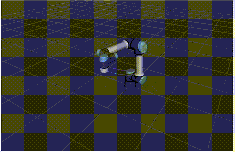
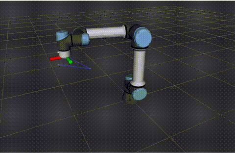
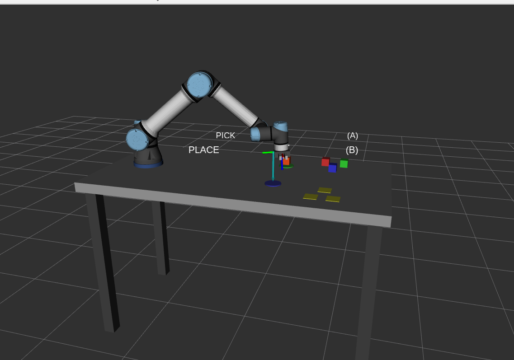

<div align="center">

# Industrial Robots

### Multi-Brand Robotic Arm Integration with ROS2

[](https://docs.ros.org/)
[](https://www.docker.com/)
[](LICENSE)
[](https://www.universal-robots.com/)

<p align="center">
  <strong>A unified framework for controlling industrial robotic arms from multiple manufacturers using ROS2</strong>
</p>

<table>
<tr>
<td align="center" width="50%">



**Circular Path Following**

</td>
<td align="center" width="50%">



**Target Tracking Demo**

</td>
</tr>
</table>

---

[Getting Started](#-getting-started) •
[Features](#-features) •
[Supported Robots](#-supported-robots) •
[Projects](#-projects) •
[Documentation](#-documentation) •
[Contributing](#-contributing)

</div>

---

## Overview

**Industrial Robots** is a comprehensive, containerized solution for integrating and controlling industrial robotic arms from various manufacturers within the ROS2 ecosystem. This project provides a unified interface for simulation and real-world deployment, enabling seamless development and testing workflows.

---

## Features

| Feature | Description |
|---------|-------------|
| **Multi-Brand Support** | Unified interface for robots from Universal Robots, and more |
| **ROS2 Integration** | Full support for Humble, Jazzy, and Rolling distributions |
| **Containerized Stack** | Complete Docker-based deployment - no host ROS2 installation required |
| **Simulation Ready** | Integrated simulators for safe development and testing |
| **Real Robot Control** | Same codebase works for simulation and physical robots |
| **Modular Architecture** | Easy to extend with additional robot brands and models |
| **Screw Theory Kinematics** | FK/IK implementation using Product of Exponentials (PoE) formula |

---

## Supported Robots

<table>
<tr>
<td align="center" width="33%">

### Universal Robots
**UR3e | UR5e | UR10e | UR16e | UR20 | UR30**

URSim integration included

</td>
<td align="center" width="33%">

### Coming Soon
**ABB | FANUC | KUKA**

Additional brands in development

</td>
<td align="center" width="33%">

### Custom Integration
**Your Robot Here**

Extensible architecture

</td>
</tr>
</table>

---

## Projects

<table>
<tr>
<td align="center" width="50%">



</td>
<td width="50%">

### UR Pick and Place Workcell

A complete pick and place demonstration featuring:

- UR5e robot with parallel gripper
- Industrial worktable (1.0m x 0.7m)
- Pick location with colored cubes
- Place location with target markers

[View Project Documentation](docs/PROJECTS.md#project-1-ur-pick-and-place-workcell)

</td>
</tr>
<tr>
<td align="center" width="50%">

*RViz: robot + colored toolpath preview*

</td>
<td width="50%">

### UR 3D Printer

Turn any UR arm (UR3e–UR30) into a 3D printer:

- G-code parsing (G0/G1/G2/G3, arcs, layers)
- Screw-theory IK with seed chaining
- Trapezoidal velocity profiles + singularity avoidance
- FDM/paste extruder simulation + RViz toolpath preview

[View Project Documentation](docs/PROJECTS.md#project-2-ur-3d-printer)

</td>
</tr>
</table>

---

## Getting Started

### Prerequisites

| Requirement | Version |
|-------------|---------|
| Docker | 20.10+ |
| Docker Compose | v2+ |
| Disk Space | ~8GB |

### Quick Start

```bash
# Clone the repository
git clone https://github.com/Kmedrano101/industrial_robots.git
cd industrial_robots

# Build the Docker images
./docker/scripts/build.sh

# Start simulation environment
./docker/scripts/start.sh sim

# Access URSim web interface (VNC)
# Open http://localhost:6080/vnc.html in your browser
```

---

## Usage

### Simulation Mode

Launch the complete simulation stack including URSim and ROS2 drivers:

```bash
# Using Docker Compose
docker compose --profile sim up

# Or using the helper script
./docker/scripts/start.sh sim
```

Access the URSim interface at **http://localhost:6080/vnc.html**

### Real Robot Mode

Connect to a physical robot:

```bash
# Configure robot IP address
echo "ROBOT_IP=192.168.1.100" >> .env

# Launch the driver
./docker/scripts/start.sh real --robot-ip 192.168.1.100
```

### Switch ROS2 Distribution

```bash
# Build for a specific ROS2 version
ROS_DISTRO=jazzy ./docker/scripts/build.sh

# Run with the specified version
ROS_DISTRO=jazzy docker compose --profile sim up
```

---

## Kinematics

The project includes a complete **Screw Theory** based kinematics implementation for Universal Robots:

### Features

- **Forward Kinematics (FK):** Product of Exponentials formula
- **Inverse Kinematics (IK):** Damped Newton-Raphson solver with sub-millimeter accuracy
- **Jacobian Computation:** Space and body frame Jacobians
- **Multi-Model Support:** Configuration files for all UR models (UR3e, UR5e, UR10e, UR16e, UR20, UR30)

### Quick Example

```python
from ur_kinematics_node.screw_kinematics import URScrewKinematics
from ur_kinematics_node.robot_parameters import create_ur5e_parameters
import numpy as np

# Initialize UR5e kinematics
kinematics = URScrewKinematics(create_ur5e_parameters())

# Forward Kinematics
q = np.array([0, -np.pi/4, np.pi/2, -np.pi/4, -np.pi/2, 0])
T = kinematics.fk(q)
print(f"Position: {T[:3, 3]}")  # [0.2234, -0.1553, 0.4432]

# Inverse Kinematics
solution = kinematics.ik(T)
print(f"IK converged: {solution.is_valid}")  # True
```

For detailed mathematical background and test results, see [Screw Theory Kinematics](docs/SCREW_THEORY_KINEMATICS.md).

### Quick Test

Run IK movement tests with the simulated robot:

```bash
# Start the development container
docker compose --profile dev up -d ros2-dev

# Enter the container
docker exec -it ros2-dev bash

# Build and source the workspace
cd /home/ros/workspace
source /opt/ros/humble/setup.bash
colcon build --symlink-install
source install/setup.bash

# Run FK/IK verification tests
python3 src/ur_kinematics_node/test_fk_ik.py

# Run IK movement test (requires driver running with fake hardware)
export ROS_DOMAIN_ID=10
python3 src/ur_kinematics_node/test_ik_movement.py
```

Expected output: All tests pass with < 0.01mm position error.

---

## Configuration

Create your environment configuration:

```bash
cp .env.example .env
```

### Environment Variables

| Variable | Default | Description |
|----------|---------|-------------|
| `ROS_DISTRO` | `humble` | ROS2 distribution version |
| `ROBOT_IP` | `172.28.0.10` | Target robot IP address |
| `UR_TYPE` | `ur5e` | Universal Robots model type |
| `ROBOT_MODEL` | `UR5` | URSim robot model |

---

## Project Structure

```
industrial_robots/
├── docker-compose.yml          # Container orchestration
├── .env                        # Environment configuration
├── docker/
│   ├── ros2-driver/            # ROS2 driver container
│   ├── ursim/                  # URSim container
│   └── scripts/                # Build and launch scripts
├── config/                     # Robot configurations
├── programs/                   # Robot programs (URScript, etc.)
├── workspace/                  # ROS2 development workspace
│   └── src/
│       ├── ur_screw_kinematics/    # C++ kinematics library
│       ├── ur_kinematics_node/     # Python ROS2 kinematics node
│       ├── ur_kinematics_msgs/     # ROS2 message definitions
│       ├── ur_pick_place/          # Pick and place demo project
│       └── ur_3d_printer/          # UR arm as 3D printer
└── docs/                       # Extended documentation
```

---

## Documentation

| Document | Description |
|----------|-------------|
| [Quick Setup Guide](docs/QUICK_SETUP.md) | Step-by-step installation |
| [Projects](docs/PROJECTS.md) | Example projects and applications |
| [Network Architecture](docs/NETWORK_ARCHITECTURE.md) | Network configuration details |
| [Docker Architecture](docs/DOCKER_ARCHITECTURE.md) | Container structure overview |
| [Screw Theory Kinematics](docs/SCREW_THEORY_KINEMATICS.md) | FK/IK implementation and test results |

---

## Contributing

Contributions are welcome! Please feel free to submit a Pull Request.

1. Fork the repository
2. Create your feature branch (`git checkout -b feature/AmazingFeature`)
3. Commit your changes (`git commit -m 'Add some AmazingFeature'`)
4. Push to the branch (`git push origin feature/AmazingFeature`)
5. Open a Pull Request

---

## License

This project is licensed under the MIT License - see the [LICENSE](LICENSE) file for details.

---

<div align="center">

**Built for the robotics community**

</div>
