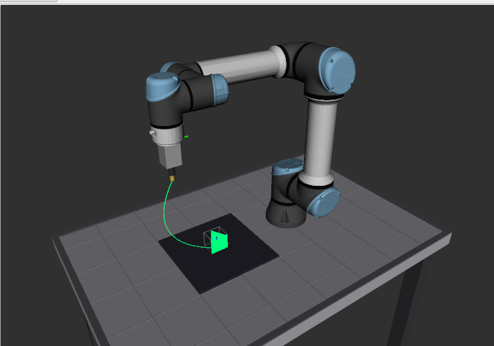

# Projects

This document contains example projects and applications built with the Industrial Robots framework.

---

## Project 1: UR Pick and Place Workcell

A complete pick and place demonstration using a UR5e robot with a custom workcell including an industrial table, parallel gripper, and colored objects.


### Description

This project demonstrates a typical industrial pick and place application:

- **UR5e Robot Arm** - 6-DOF collaborative robot
- **Industrial Table** - 1.0m x 0.7m work surface with robot mount
- **Parallel Gripper** - Two-finger gripper attached to tool flange
- **Pick Objects** - Three colored cubes (red, green, blue) at pick location (A)
- **Place Markers** - Three yellow markers at place location (B)

The robot picks objects from location A and places them at location B, demonstrating basic motion planning and gripper control.

### Package Structure

```
workspace/src/ur_pick_place/
├── config/
│   ├── pick_place.yaml      # Node configuration
│   └── pick_place.rviz      # RViz visualization config
├── launch/
│   ├── ur_pick_place_driver.launch.py   # Main launch file
│   └── ur_pick_place_rsp.launch.py      # Robot state publisher
├── urdf/
│   ├── ur_pick_place_cell.urdf.xacro    # Complete workcell URDF
│   ├── parallel_gripper.urdf.xacro      # Gripper description
│   └── industrial_table.urdf.xacro      # Table description
└── ur_pick_place/
    ├── pick_place_node.py    # Pick and place logic
    └── gripper_controller.py # Gripper control node
```

### Prerequisites

1. **URSim Running** - Start the UR simulator in Docker:
   ```bash
   docker run -d --rm \
       -p 5900:5900 -p 6080:6080 -p 29999:29999 -p 30001-30004:30001-30004 \
       -e ROBOT_MODEL=UR5 \
       --name ursim \
       universalrobots/ursim_e-series
   ```

2. **ROS2 Jazzy** - Install ROS2 and ur_robot_driver:
   ```bash
   sudo apt install ros-jazzy-ur-robot-driver
   ```

3. **Build the Package**:
   ```bash
   cd ~/src/industrial_robots/workspace
   source /opt/ros/jazzy/setup.bash
   colcon build --packages-select ur_pick_place --symlink-install
   ```

### Running the Project

1. **Start URSim** and wait for it to reach "Normal" state (access via http://localhost:6080)

2. **Power ON the Robot** in URSim:
   - Click the red power button
   - Click "ON" then "START"
   - Robot should show "Normal" status

3. **Launch the Driver with Workcell**:
   ```bash
   source /opt/ros/jazzy/setup.bash
   source ~/src/industrial_robots/workspace/install/setup.bash
   ros2 launch ur_pick_place ur_pick_place_driver.launch.py robot_ip:=172.17.0.2 headless_mode:=true
   ```

4. **Configure External Control in URSim**:
   - Go to Installation → URCaps → External Control
   - Set Host IP to your machine's IP (run `hostname -I` to find it)
   - Create a new program with External Control node
   - Press PLAY

5. **RViz** will automatically open showing the workcell with robot, table, gripper, and objects.

### Launch Arguments

| Argument | Default | Description |
|----------|---------|-------------|
| `robot_ip` | `172.17.0.2` | IP address of URSim or real robot |
| `ur_type` | `ur5e` | Robot model (ur3e, ur5e, ur10e, etc.) |
| `headless_mode` | `true` | Run without teach pendant |
| `launch_rviz` | `true` | Launch RViz visualization |
| `include_gripper` | `true` | Include gripper in URDF |
| `include_objects` | `true` | Include pick/place objects |

### Services

| Service | Type | Description |
|---------|------|-------------|
| `/pick_place_node/pick_place` | `PickPlace` | Execute pick and place cycle |
| `/gripper_controller/set_gripper` | `SetGripper` | Open/close gripper |

### Example Commands

```bash
# Execute pick and place
ros2 service call /pick_place_node/pick_place ur_pick_place/srv/PickPlace "{}"

# Open gripper
ros2 service call /gripper_controller/set_gripper ur_pick_place/srv/SetGripper "{open: true}"

# Close gripper
ros2 service call /gripper_controller/set_gripper ur_pick_place/srv/SetGripper "{open: false}"

# Check joint states
ros2 topic echo /joint_states
```

### Configuration

Edit `config/pick_place.yaml` to customize positions:

```yaml
pick_place_node:
  ros__parameters:
    pick_position: [0.20, 0.15, 0.92]   # Pick location (x, y, z)
    place_position: [0.20, -0.15, 0.92] # Place location (x, y, z)
    approach_height: 0.15               # Height above object for approach
    object_height: 0.04                 # Object height for grasp calculation
```

---

## Project 2: UR 3D Printer

A ROS2 package that turns any Universal Robots arm (UR3e–UR30) into a 3D printer.
G-code is parsed, converted to Cartesian waypoints, solved through screw-theory IK,
and streamed to the robot as `JointTrajectory` messages — all in real-time.



### Description

This project demonstrates advanced trajectory generation and real-time motion control:

- **G-code Support** — Standard FDM slicer output (PrusaSlicer, Cura, etc.)
- **Screw-Theory IK** — Levenberg-Marquardt solver with seed chaining for smooth motion
- **Trapezoidal Velocity Profiles** — Singularity-aware speed scaling, corner blending
- **FDM / Paste Extruder Simulation** — Temperature, flow rate, retraction
- **URSim Integration** — Runs on URSim via `ur_robot_driver` with RViz visualization

### Package Structure

```
workspace/src/ur_3d_printer/
├── config/
│   ├── print_params.yaml           # All node parameters
│   └── printer_3d.rviz             # RViz layout
├── launch/
│   └── print_ursim.launch.py       # Main launch (requires UR driver running)
├── msg/
│   ├── PrintState.msg
│   └── PrintProgress.msg
├── srv/
│   ├── StartPrint.srv
│   ├── PausePrint.srv
│   ├── ResumePrint.srv
│   ├── CancelPrint.srv
│   └── CalibrateOrigin.srv
├── urdf/
│   ├── optical_table.urdf.xacro    # Optical breadboard table
│   ├── fdm_extruder.urdf.xacro     # Extruder tool
│   └── print_bed.urdf.xacro        # Print bed surface
└── ur_3d_printer/
    ├── print_node.py           # Main state machine
    ├── gcode_parser.py         # G0/G1/G2/G3 parser
    ├── trajectory_planner.py   # IK + velocity profiling
    ├── workspace_validator.py  # Pre-print safety checks
    ├── velocity_profiler.py    # Trapezoidal velocity profile
    ├── extruder_controller.py  # FDM extruder simulation
    └── toolpath_visualizer.py  # RViz MarkerArray publisher
```

### Prerequisites

1. **ROS2 Jazzy** with `ur_robot_driver`:
   ```bash
   sudo apt install ros-jazzy-ur-robot-driver
   ```

2. **Build the packages**:
   ```bash
   cd ~/src/industrial_robots/workspace
   source /opt/ros/jazzy/setup.bash
   colcon build --packages-select ur_3d_printer ur_kinematics_node \
                ur_screw_kinematics ur_kinematics_msgs --symlink-install
   source install/setup.bash
   ```

### Running the Project (Step by Step)

```bash
# ── 1. Start URSim container ──────────────────────────────────────────
docker compose --profile sim up

# Open teach pendant: http://localhost:6080/vnc.html
#   Power ON → ON → START
#   Wait for robot status to show "Normal"

# ── 2. Build all required packages ────────────────────────────────────
cd ~/src/industrial_robots/workspace
source /opt/ros/jazzy/setup.bash
colcon build --packages-select ur_3d_printer ur_kinematics_node \
             ur_screw_kinematics ur_kinematics_msgs --symlink-install
source install/setup.bash

# ── 3. Launch the UR driver (Terminal 1) ──────────────────────────────
# Connects to URSim and starts the robot controllers.
ros2 launch ur_robot_driver ur_control.launch.py \
    ur_type:=ur5e \
    robot_ip:=172.20.0.2 \
    headless_mode:=true \
    launch_rviz:=false \
    initial_joint_controller:=joint_trajectory_controller

# ── 4. Resend the robot program (Terminal 2) ──────────────────────────
# Sends the External Control program so URSim accepts motion commands.
ros2 service call /io_and_status_controller/resend_robot_program \
    std_srvs/srv/Trigger "{}"

# ── 5. Launch the 3D printer app (Terminal 2) ─────────────────────────
# Starts kinematics server, extruder controller, print node, RViz,
# and workcell visualization (table, bed, extruder).
# Pass robot_model and optionally preload a G-code file for toolpath preview.
ros2 launch ur_3d_printer print_ursim.launch.py \
    robot_model:=ur5e \
    gcode_file:=$(ros2 pkg prefix ur_3d_printer)/share/ur_3d_printer/resource/triangle_prism.gcode

# ── 6. Start a print (Terminal 3) ────────────────────────────────────
# IK planning takes ~10-15s, then the robot begins tracing the toolpath.
# Watch the TCP trail (green) and robot model in RViz.
ros2 service call /print_node/start_print ur_3d_printer/srv/StartPrint \
    "{gcode_filepath: '$(ros2 pkg prefix ur_3d_printer)/share/ur_3d_printer/resource/triangle_prism.gcode'}"

# ── 7. Monitor progress ──────────────────────────────────────────────
ros2 topic echo /print_node/state        # Current state
ros2 topic echo /print_node/progress     # Layer progress
```

> **Note:** Steps 3-4 only need to be done once per URSim session.
> If the robot reports "path tolerance violation", re-run the
> `resend_robot_program` command from step 4.

### Included G-code Files

| File | Shape | Size | Layers |
|------|-------|------|--------|
| `rectangle.gcode` | 40mm x 20mm rectangle | 10 layers (1mm each) | Quick test print |
| `triangle_prism.gcode` | 60mm equilateral triangle | 50 layers (1mm each, 5cm tall) | Full demo |

### Launch Arguments (`print_ursim.launch.py`)

| Argument | Default | Description |
|----------|---------|-------------|
| `gcode_file` | `''` | G-code file to preload for toolpath visualization |
| `robot_model` | `ur5e` | UR robot model |
| `launch_rviz` | `true` | Open RViz |

### Services

| Service | Type | Description |
|---------|------|-------------|
| `/print_node/start_print` | `StartPrint` | Load G-code and start printing |
| `/print_node/pause_print` | `PausePrint` | Pause at end of current trajectory |
| `/print_node/resume_print` | `ResumePrint` | Resume from paused state |
| `/print_node/cancel_print` | `CancelPrint` | Abort and return to idle |
| `/print_node/calibrate_origin` | `CalibrateOrigin` | Set print origin from current TCP pose |

### Example Commands

```bash
# Print a triangular prism (60mm triangle, 50 layers, ~10 min)
ros2 service call /print_node/start_print ur_3d_printer/srv/StartPrint \
    "{gcode_filepath: '$(ros2 pkg prefix ur_3d_printer)/share/ur_3d_printer/resource/triangle_prism.gcode'}"

# Print a small rectangle (40x20mm, 10 layers, ~2 min)
ros2 service call /print_node/start_print ur_3d_printer/srv/StartPrint \
    "{gcode_filepath: '$(ros2 pkg prefix ur_3d_printer)/share/ur_3d_printer/resource/rectangle.gcode'}"

# Pause mid-print
ros2 service call /print_node/pause_print ur_3d_printer/srv/PausePrint "{}"

# Resume
ros2 service call /print_node/resume_print ur_3d_printer/srv/ResumePrint "{}"

# Monitor progress
ros2 topic echo /print_node/progress
```

### Configuration

Edit `config/print_params.yaml` to customize the print origin and motion parameters:

```yaml
print_node:
  ros__parameters:
    # Print origin (G-code 0,0,0 = bed surface in robot base frame)
    print_origin_xyz: [-0.3, 0.0, -0.01]  # meters (bed surface at x=-0.3)
    print_origin_rpy: [0.0, 0.0, 0.0]     # no rotation (nozzle-down is per-waypoint)

    # Tool offset (flange to nozzle tip)
    tool_offset_xyz: [0.0, 0.0, 0.105]    # 10.5 cm (heatsink + heatbreak + nozzle)

    # Motion limits
    max_print_velocity:  0.05   # m/s  — extrusion moves
    max_travel_velocity: 0.15   # m/s  — travel moves
    max_acceleration:    0.5    # m/s²
    waypoint_density:    0.010  # m    — max segment length (10 mm)

    # Arm-robot safety
    z_hop_enabled: true
    z_hop_height:  0.005        # 5 mm lift before travel
    max_joint_jump: 0.5         # rad — IK branch guard
    singularity_threshold: 0.05
    min_reach_radius: 0.17      # m
    max_reach_radius: 0.85      # m

    # Controller (must match the active ros2_control controller)
    trajectory_controller: "joint_trajectory_controller"
```

### Running Tests

```bash
colcon test --packages-select ur_3d_printer
colcon test-result --test-result-base build/ur_3d_printer --all
# Expected: 104 tests, 0 failures
```

For full documentation see [`workspace/src/ur_3d_printer/README.md`](../workspace/src/ur_3d_printer/README.md).

---

## More Projects Coming Soon

- **Vision-Based Sorting** - Camera integration for object detection
- **Palletizing Demo** - Multi-layer stacking patterns
- **Conveyor Tracking** - Synchronized motion with moving objects
