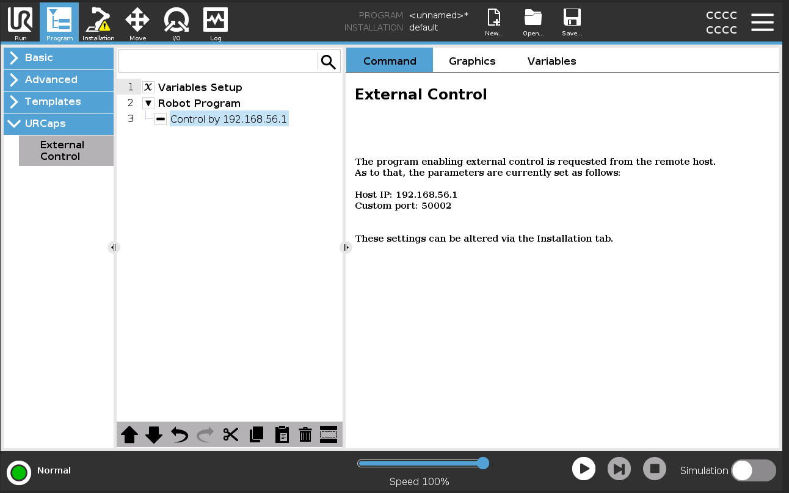
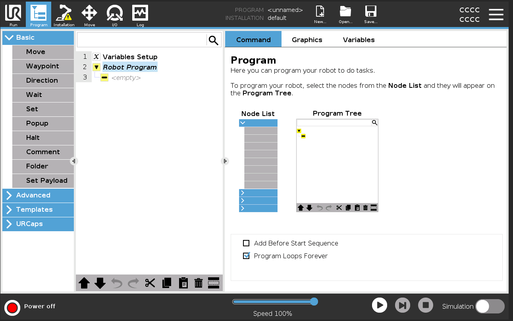

# URSim + ROS2 External Control - Quick Setup Guide

> Fast-track guide to connect ROS2 with Universal Robots simulator

---

## Prerequisites

| Requirement | Version |
|-------------|---------|
| Docker | 20.10+ |
| ROS2 | Humble |
| ur_robot_driver | 2.11.0+ |

---

## Step 1: Create Directories

```bash
mkdir -p ${HOME}/.ursim/programs
mkdir -p ${HOME}/.ursim/urcaps
```

---

## Step 2: Download External Control URCap

```bash
URCAP_VERSION=1.0.5
curl -L -o ${HOME}/.ursim/urcaps/externalcontrol-${URCAP_VERSION}.jar \
  https://github.com/UniversalRobots/Universal_Robots_ExternalControl_URCap/releases/download/v${URCAP_VERSION}/externalcontrol-${URCAP_VERSION}.jar
```

---

## Step 3: Start URSim Container

```bash
docker run --rm -it \
  -p 5900:5900 \
  -p 6080:6080 \
  -p 29999:29999 \
  -p 30001:30001 \
  -p 30002:30002 \
  -p 30003:30003 \
  -p 30004:30004 \
  -v ${HOME}/.ursim/urcaps:/urcaps \
  -v ${HOME}/.ursim/programs:/ursim/programs \
  -e ROBOT_MODEL=UR5 \
  --name ursim \
  universalrobots/ursim_e-series
```

---

## Step 4: Configure External Control in URSim

1. Open URSim web interface: http://localhost:6080/vnc.html
2. Power on the robot (red button → Power On → Start)
3. Go to **Installation → URCaps → External Control**
4. Set **Host IP**: `172.17.0.1` (Docker host)
5. Set **Port**: `50002`
6. Save installation



---

## Step 5: Create Robot Program

1. Go to **Program → Empty Program**
2. Add **URCaps → External Control** node
3. Save as `external_control.urp`



---

## Step 6: Launch ROS2 Driver

```bash
ros2 launch ur_robot_driver ur_control.launch.py \
  ur_type:=ur5e \
  robot_ip:=172.17.0.2 \
  headless_mode:=true \
  launch_rviz:=true \
  initial_joint_controller:=joint_trajectory_controller
```

> **Note**: Use `initial_joint_controller:=joint_trajectory_controller` to avoid segfault issues with scaled controller in version 2.11.0

---

## Step 7: Run External Control Program

1. In URSim, load `external_control.urp`
2. Press **Play**
3. Robot should connect to ROS2 driver

---

## Step 8: Test Motion Command

```bash
ros2 action send_goal /joint_trajectory_controller/follow_joint_trajectory \
  control_msgs/action/FollowJointTrajectory "{
    trajectory: {
      joint_names: [shoulder_pan_joint, shoulder_lift_joint, elbow_joint,
                    wrist_1_joint, wrist_2_joint, wrist_3_joint],
      points: [
        { positions: [0.0, -1.57, 1.57, -1.57, -1.57, 0.0], time_from_start: { sec: 5 } }
      ]
    }
  }"
```

---

## Verification Checklist

- [ ] URSim container running
- [ ] Robot powered on (green status)
- [ ] ROS2 driver launched without errors
- [ ] External Control program running
- [ ] `/joint_states` topic publishing
- [ ] RViz showing robot model
- [ ] Motion commands execute successfully

---

## Troubleshooting

| Issue | Solution |
|-------|----------|
| Connection refused on port 50002 | Ensure ROS2 driver is running before starting External Control program |
| Driver segfault | Use `initial_joint_controller:=joint_trajectory_controller` |
| ROS2 daemon not responding | Run `pkill -9 ros2_daemon && rm -rf ~/.ros/ros2d*` |
| Can't find robot IP | Run `docker inspect ursim --format '{{range .NetworkSettings.Networks}}{{.IPAddress}}{{end}}'` |

---

## Quick Reference

| Component | Address |
|-----------|---------|
| URSim Container | 172.17.0.2 |
| Docker Host (for robot) | 172.17.0.1 |
| External Control Port | 50002 |
| Web VNC | http://localhost:6080/vnc.html |
| Dashboard | localhost:29999 |

---

## Testing Screw Theory Kinematics

After setup, you can test the FK/IK implementation:

### Option 1: Standalone Test (No Robot Required)

```bash
# Enter development container
docker exec -it ros2-dev bash

# Build workspace
cd /home/ros/workspace
source /opt/ros/humble/setup.bash
colcon build --symlink-install
source install/setup.bash

# Run FK/IK verification
python3 src/ur_kinematics_node/test_fk_ik.py
```

Expected output:
```
FK verification: PASSED
IK small displacement: PASSED
IK large displacement: PASSED
Round-trip tests: ALL PASSED
```

### Option 2: IK Movement Test (With Fake Hardware)

```bash
# Start fake hardware driver (no URSim External Control needed)
docker run -d --rm --name ur-driver-fake \
  --network robots_ur-network \
  -e ROS_DOMAIN_ID=10 \
  ur-ros2-driver:humble \
  bash -c "source /opt/ros/humble/setup.bash && \
    ros2 launch ur_robot_driver ur_control.launch.py \
    ur_type:=ur5e robot_ip:=xxx use_fake_hardware:=true \
    initial_joint_controller:=joint_trajectory_controller"

# Run IK movement test
docker exec ros2-dev bash -c "
  export ROS_DOMAIN_ID=10
  source /opt/ros/humble/setup.bash
  source /home/ros/workspace/install/setup.bash
  python3 /home/ros/workspace/src/ur_kinematics_node/test_ik_movement.py"
```

Expected output:
```
IK succeeded in 32 iterations, error: 0.0073 mm
Trajectory execution succeeded
TEST PASSED: Robot reached target within 1mm
```

---

## URSim Web Interface Notes

- **URL**: Always use `http://localhost:6080/vnc.html` (not just `/6080`)
- **Connection**: Click "Connect" button in the noVNC interface
- **Robot Power**: Click the red power button → "ON" → "START"
- **External Control**: Required for ROS2 driver connection to real/simulated robot
